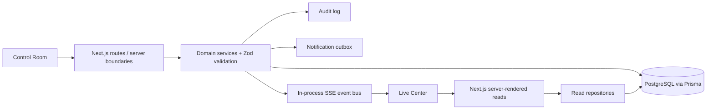

# Architecture

Sports Live Ops is a Next.js App Router application with two product surfaces over one domain and PostgreSQL source of truth: an authenticated Control Room and a public Live Center.

## Boundaries

- `src/components` - visual surfaces and client interactions.
- `src/lib/domain` - deterministic lifecycle, score, and standings rules.
- `src/lib/server` - Prisma client, repositories, mutation services, role helpers, and event bus.
- `src/app/api` - authenticated mutation boundaries, health endpoint, and public SSE stream.
- `src/app/control` - protected operations/editorial pages.
- `src/app/live` - public competition and event experience.
- `prisma` - schema, migration, and fictional seed data.

## Mutation flow

A live operation follows a database-first flow:

1. Client submits an authenticated request.
2. The API validates input and role.
3. A service enforces domain state and writes the database transaction.
4. Audit/outbox records are written where applicable.
5. Only after persistence succeeds, an SSE invalidation event is emitted.
6. Public clients refresh their server-rendered event snapshot from PostgreSQL.

This avoids treating browser state or the realtime channel as authoritative.
