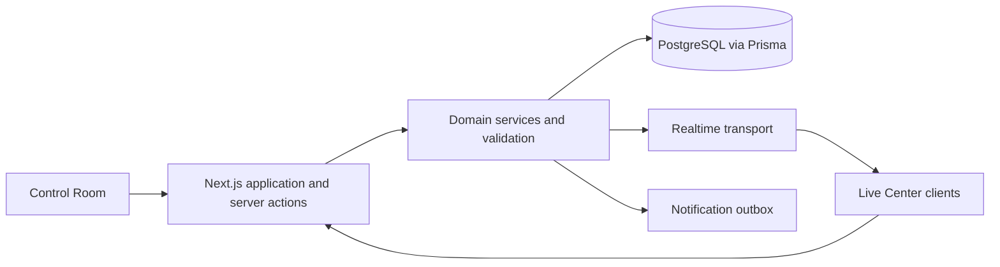

# Architecture

The application is a Next.js App Router product with two surfaces: an authenticated Control Room and a public Live Center. The approved workstation UI remains in the existing components; server-side data access is kept under `src/lib/server` and domain rules under `src/lib/domain`.

## Boundaries

- `src/components`: visual surfaces and interaction composition.
- `src/lib/domain`: deterministic business rules that can be unit tested without a database.
- `src/lib/server`: Prisma client and query/repository functions.
- `src/app/api`: HTTP boundaries for health and future public/operator APIs.
- `prisma`: relational schema, migration SQL, and fictional seed data.

The current repository is in the persistence foundation phase. Authentication, mutation services, and realtime transport are intentionally not described as implemented until they are wired to the database.
