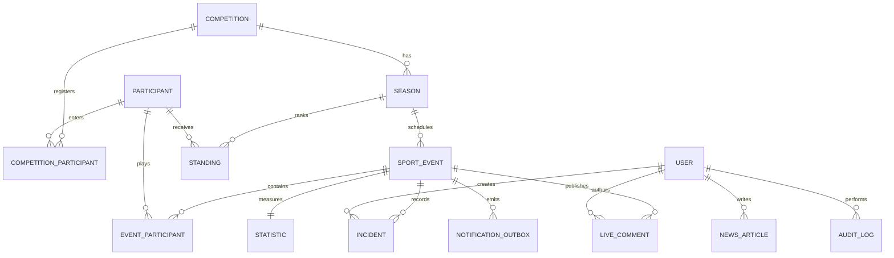

# Domain model

Sports Live Ops uses PostgreSQL through Prisma. The model keeps the competition and event concepts reusable while the first sport implementation supplies football incidents and standings rules.

## Source of truth

- Event state is stored on `SportEvent` and changed only through validated transitions.
- Goals are stored as `Incident` records. Score is derived from active goal incidents; corrections reference the incident they supersede.
- Finished event results are the input to standings calculation. Seed standings mirror the finished fictional fixtures.
- `Statistic` stores validated match-level football measures for both sides.
- Published content is identified by `NewsArticle.status = PUBLISHED` and `publishedAt`; public queries must never return drafts.
- `AuditLog` and `NotificationOutbox` are append-oriented operational records, not UI-only history.

## Current limitation

The repository contains the PostgreSQL schema, generated migration, and seed, but this environment has no running PostgreSQL service. `prisma migrate dev` and `prisma db seed` must be run after setting `DATABASE_URL` against a local or hosted PostgreSQL instance.
